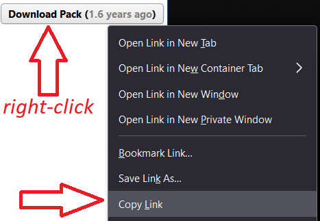

# sm

A command-line interface for interacting with StepMania simfile packs - download new packs and update existing ones right from your terminal!

## Installation
`sm` is available as a downloadable binary from the [releases page](https://github.com/ScottBrenner/sm/releases).

## Usage
`sm` creates and interacts with an additional file within a pack's directory, `source.txt`. This file merely contains the source where the pack can be downloaded from.

First, navigate to a pack's directory and initialize `sm` with the `init` argument:
```
$ cd Games/ITGmania/Songs/
$ mkdir 7guys1pack
$ cd 7guys1pack
$ sm init
Enter download source for pack: https://zenius-i-vanisher.com/v5.2/download.php?type=ddrpack&categoryid=127
```
Please be aware that **the source URL here is the direct download location, and not the simfile overview page**. From the overview page on Zenius this URL can be found by right-clicking the "Download Pack" button and navigating to "Copy Link"



Once initialized, download the pack with the `download` argument, be patient as this may take some time:
```
$ sm download
Downloading pack...
Unpacking pack...
```

`sm` downloads the pack, extracts it, and deletes the downloaded archive. Already-downloaded packs can be updated with the same method.

## Development

### GitHub Codespaces
Follow these steps to open this project in a Codespace:
1. Click the **Code** drop-down menu.
2. Click on the **Codespaces** tab.
3. Click **Create codespace on main** .

For more info, check out the [GitHub documentation](https://docs.github.com/en/free-pro-team@latest/github/developing-online-with-codespaces/creating-a-codespace#creating-a-codespace).

## Contributing

This project welcomes contributions and suggestions.

## License

Copyright © Scott Brenner All rights reserved.<br />
Licensed under the MIT License. See LICENSE in the project root for license information.
